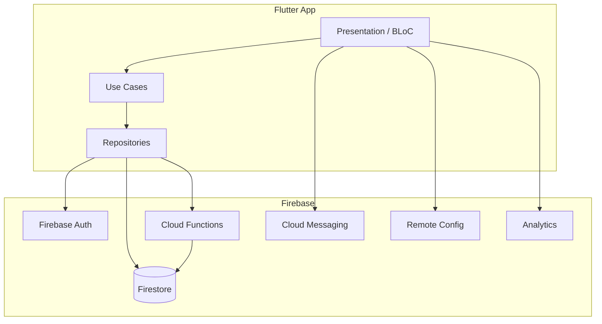

# WordSchool — Production Readiness Document

**Generated:** 2026-07-05  
**App version:** 1.0.0+4  
**Branch:** `development`  
**Status:** Ready for production release after completing the checklist below.

---

## Executive Summary

WordSchool is a Flutter Wordle-style daily puzzle app with **Story Mode** (detective cases), auth, streaks, archive, leaderboards, push notifications, and optional monetization (AdMob + IAP). The backend runs on **Firebase** (Firestore, Auth, Cloud Functions, FCM, Remote Config, Analytics).

| Area | Status |
|------|--------|
| Flutter unit/widget tests | **58/58 passing** |
| Cloud Functions tests | **11/11 passing** |
| `flutter analyze` | 0 errors, 22 info/warnings (non-blocking) |
| npm audit (functions) | 10 moderate (transitive dev deps — see Vulnerabilities) |
| Dev/prod environments | Configured via flavors |
| Firestore security rules | Present and validated |
| Build artifacts in git | **Cleaned** (`ios/build/` removed from tracking) |

---

## What Is In The Project Today

### Mobile App (Flutter)

**Entry points**

| File | Purpose |
|------|---------|
| `lib/main.dart` | Default entry — delegates to dev (safe default) |
| `lib/main_dev.dart` | Dev flavor → Firestore `development` database |
| `lib/main_prod.dart` | Prod flavor → Firestore `(default)` database |

**Features** (`lib/features/`)

| Feature | Description |
|---------|-------------|
| `auth` | Anonymous, Google, and Apple sign-in |
| `dashboard` | Home screen with daily puzzle + story mode heroes |
| `game` | Daily Wordle puzzle (5×5 grid, keyboard, validation) |
| `story_mode` | Detective case flow: intro → hints → wordle clues → resolution |
| `archive` | Past game history |
| `leaderboard` | Weekly detective score leaderboard |
| `settings` | Logout, account deletion, legal pages, story settings |
| `notifications` | FCM + local reminders (daily puzzle, detective case, streak) |
| `winning` | Win celebration screen |

**Shared modules** (`lib/shared/`)

- Session persistence (`SessionHandler`, `SessionRepository`)
- User game state (Firestore sync, streaks, guesses)
- Reusable UI widgets (tiles, buttons, nav bar, scaffolds)

**Core infrastructure** (`lib/core/`)

| Module | Purpose |
|--------|---------|
| `config/` | `AppConfig`, environments, monetization flags |
| `firebase/` | Bootstrap, Firestore provider, collection names |
| `routes/` | GoRouter setup, shell navigation |
| `analytics/` | Firebase Analytics events |
| `monetization/` | AdMob, IAP, story entitlements |
| `remote_config/` | Story mode rollout gating |
| `resorces/` | `DataState`, `UseCase` base types *(typo — see Tech Debt)* |
| `utils/` | Valid words, date helpers, scoring calculators |
| `logging/` | App logger + BLoC observer |

**App shell** (`lib/app/`)

- `bootstrap.dart` — shared startup (Firebase, dotenv, DI, routing)
- `word_school_app.dart` — root `MaterialApp`

### Backend (Firebase Cloud Functions)

Location: `functions/src/`

| Export | Purpose |
|--------|---------|
| `generateDailyCase` | Scheduled daily detective case generation |
| `seedDetectiveCase` | Manual case seeding |
| `updateDetectiveLeaderboard` | Weekly leaderboard aggregation |
| `softDeleteUserAccount` | Callable — GDPR-style account soft delete |
| `sendStreakAtRiskReminders` | Push notification cron |
| `sendStreakMilestoneNotification` | Milestone push |
| `sendReengagementNotification` | Re-engagement push |
| `notifyNewDetectiveCase` | New case alert |

Scripts: `seed`, `seed:planned`, `copy:firestore`

### Firebase Configuration

| Resource | File |
|----------|------|
| Firestore rules | `firestore.rules` |
| Firebase config | `firebase.json` |
| iOS flavors | `ios/flavors/dev/`, `ios/flavors/prod/` |
| Android flavors | `android/app/src/dev/`, `android/app/src/prod/` |
| FlutterFire options | `lib/firebase_options_dev.dart`, `lib/firebase_options_prod.dart` |

### Environments

| | Dev | Prod |
|---|-----|------|
| Bundle ID | `com.wordschool.mat.dev` | `com.wordschool.mat` |
| Display name | WordSchool Dev | WordSchool |
| Firestore DB | `development` | `(default)` |
| Env file | `.env.dev` | `.env.prod` |
| Firebase project | `wordschool-dev` | `wordschool-dev` *(same project, separate DB)* |

Run commands:

```bash
# Dev
fvm flutter run -t lib/main_dev.dart --flavor dev

# Production
fvm flutter run -t lib/main_prod.dart --flavor prod
```

See also: `technical_doc/environments/`

### Assets

- `assets/words/words.txt` — valid guess dictionary
- `assets/words/answers.txt` — answer word list
- `assets/svgs/` — icons
- `assets/audio/` — story mode sound effects
- `assets/legal/` — privacy policy, terms
- `assets/playstore/` — store screenshots

### Tests

| Suite | Count | Location |
|-------|-------|----------|
| Flutter | 58 tests | `test/features/story_mode/**`, `test/features/dashboard/**` |
| Cloud Functions | 11 tests | `functions/src/**/*.test.ts` |

### Documentation

| Path | Content |
|------|---------|
| `README.md` | Architecture overview (partially outdated — see Tech Debt) |
| `technical_doc/story_mode/` | Story mode phase docs + manual testing |
| `technical_doc/environments/` | Flavor setup guides |
| `technical_doc/PRODUCTION_READINESS.md` | This document |

---

## Project Structure

```
Wordschool/
├── lib/
│   ├── app/                    # Bootstrap + root widget
│   ├── config/                 # Theme, Google auth config
│   ├── core/                   # Cross-cutting infrastructure
│   ├── di.dart                 # GetIt dependency injection
│   ├── features/               # Feature-first modules
│   │   ├── auth/
│   │   ├── dashboard/
│   │   ├── game/
│   │   ├── story_mode/
│   │   ├── archive/
│   │   ├── leaderboard/
│   │   ├── settings/
│   │   ├── notifications/
│   │   └── winning/
│   ├── shared/                 # Shared domain/data/UI
│   ├── main.dart
│   ├── main_dev.dart
│   └── main_prod.dart
├── functions/                  # Firebase Cloud Functions (Node 20)
├── test/                         # Flutter tests
├── assets/                       # Static assets
├── android/                      # Android flavor configs
├── ios/                          # iOS flavor configs
├── firestore.rules
├── firebase.json
└── technical_doc/                # Technical documentation
```

Each feature follows **clean architecture** layers where applicable:

```
feature/
  data/           # Repositories impl, data sources (local + remote/)
  domain/         # Entities, repository contracts, use cases
  presentation/   # BLoC/Cubit, pages, widgets
```

---

## Vulnerability Assessment

### Flutter / Dart

- No dedicated `dart pub audit` equivalent in current SDK.
- `fvm dart pub outdated` shows several packages with newer versions available. **No known critical CVEs** flagged by the tooling.
- Recommendation: upgrade Firebase packages (`firebase_core`, `cloud_firestore`, etc.) in a follow-up release — not required for initial launch but improves long-term security.

### Cloud Functions (npm)

**10 moderate** vulnerabilities (as of 2026-07-05), all **transitive**:

| Package | Severity | Notes |
|---------|----------|-------|
| `uuid` | Moderate | Via `firebase-admin` → `@google-cloud/*` |
| `ts-deepmerge` | Moderate | Via `firebase-functions-test` (dev only) |
| `js-yaml` | Moderate | Via Jest tooling (dev only) |

- `npm audit fix` applied one safe fix.
- Remaining issues require `npm audit fix --force` with **breaking downgrades** — not recommended before launch.
- **Production runtime** (`firebase-admin`, `firebase-functions`) uses maintained major versions; dev-only vulns do not affect deployed functions.

---

## Fixes Applied (This Session)

1. **Fixed `di.dart`** — added missing `FirebaseFunctions.instance` for account deletion.
2. **Regenerated Freezed code** — `DeleteAccountRequested` event in settings bloc.
3. **Fixed dashboard widget test** — added `LoadTodayDetectiveCaseUseCase`, `SessionHandler`, and `NotificationService` test setup.
4. **Removed `ios/build/` from git** — 67 Xcode cache files untracked; added to `.gitignore`.
5. **Removed unused import** in `consume_hint.dart`.

---

## Pre-Launch Checklist

### Must do before store submission

- [ ] Run prod build: `fvm flutter build appbundle -t lib/main_prod.dart --flavor prod`
- [ ] Run prod iOS build: `fvm flutter build ipa -t lib/main_prod.dart --flavor prod`
- [ ] Deploy Firestore rules: `firebase deploy --only firestore:rules`
- [ ] Deploy Cloud Functions: `firebase deploy --only functions`
- [ ] Verify Remote Config: story mode rollout percent for prod users
- [ ] Set `IS_MONIT_PURCH=true` in `.env.prod` when ready to enable ads/IAP
- [ ] Confirm Android signing keystore is configured (`android/key.properties` — not in git)
- [ ] Test account deletion end-to-end on prod database
- [ ] Verify push notifications on physical iOS + Android devices

### Recommended

- [ ] Upgrade outdated Flutter dependencies (patch/minor first)
- [ ] Rename typo folders: `resorces` → `resources`, `repostiories` → `repositories`, `usercases` → `usecases`
- [ ] Update `README.md` to reflect current feature set (story mode, flavors, etc.)
- [ ] Add `firebase_core_platform_interface` to `dev_dependencies` for test imports
- [ ] Remove unused test imports flagged by analyzer
- [ ] Consider rotating any secrets if `.env` files were ever committed with real keys *(currently only `IS_MONIT_PURCH` flag)*

### Store listing

- [ ] Screenshots in `assets/playstore/` reviewed
- [ ] Privacy policy URL / in-app legal pages verified
- [ ] App Store Connect + Google Play Console metadata

---

## Tech Debt (Known, Non-Blocking)

| Item | Location | Impact |
|------|----------|--------|
| Folder typo `resorces` | `lib/core/resorces/` | Cosmetic; ~60 imports |
| Folder typo `repostiories` | `lib/shared/domains/repostiories/` | Cosmetic |
| Folder typo `usercases` | `lib/shared/domains/usercases/` | Cosmetic |
| File typo `sign_anonymosly.dart` | auth use case | Cosmetic |
| Duplicate data-source pattern | `data_source/` + `data_source/remote/` | Intentional abstraction layer |
| README outdated | `README.md` | Documents old game-only architecture |
| Analyzer warnings | unused `stackTrace` in catch blocks | Low priority cleanup |

---

## Architecture Diagram



---

## Quick Reference Commands

```bash
# Install dependencies
fvm flutter pub get
cd functions && npm install

# Run all tests
fvm flutter test
cd functions && npm test

# Analyze
fvm flutter analyze
cd functions && npm run lint

# Deploy backend
firebase deploy --only firestore:rules,functions

# Seed detective cases (dev)
cd functions && npm run seed:planned
```

---

## Contact / Ownership

- **Repository:** Wordschool (Flutter + Firebase)
- **Package name:** `wordshool` (pubspec)
- **Version:** 1.0.0+4

For story mode deep-dive, see `technical_doc/story_mode/fulldoc.md`.
