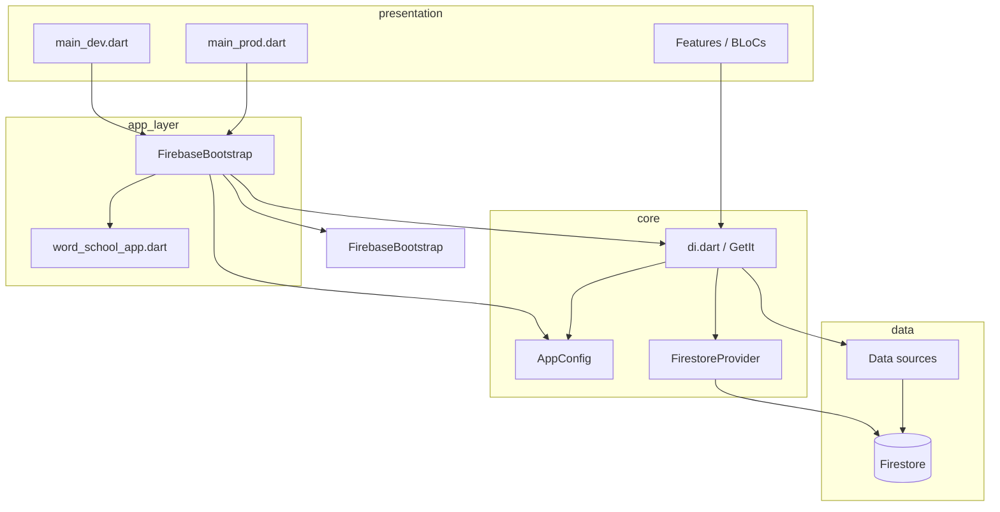

# Flutter flavors — dev & prod environments

WordSchool uses **one Firebase project** (`wordschool-dev`) with **two client environments**:

| Environment | Native flavor | Bundle / package | Firestore DB | Default? |
|-------------|---------------|------------------|--------------|----------|
| **Production** | `prod` | `com.wordschool.mat` | `(default)` | Store releases |
| **Development** | `dev` | `com.wordschool.mat.dev` | `dev` | Daily engineering |

Both apps can be installed side-by-side on the same device.

---

## Architecture (clean architecture alignment)

Environment concerns live in **`core/`**, not in features. Features depend on abstractions injected via GetIt.

```
lib/
  app/
    bootstrap.dart          # shared startup (Firebase, DI, router)
    word_school_app.dart    # MaterialApp shell
  main_dev.dart             # dev entry → Firestore `dev`
  main_prod.dart            # prod entry → Firestore `(default)`
  main.dart                 # safe default → delegates to main_dev
  core/
    config/
      app_environment.dart
      app_config.dart
    firebase/
      firebase_bootstrap.dart
      firestore_provider.dart
  config/
    google_auth_config.dart
  di.dart
```

### Dependency flow



### Rules

1. **No `FirebaseFirestore.instance` in features** — inject `FirebaseFirestore` from DI (already wired for all data sources).
2. **`AppConfig` is registered once** in `initializeDependency(appConfig: …)` and read via `getIt<AppConfig>()` when needed.
3. **Firebase options stay in generated files** — `firebase_options_prod.dart` / `firebase_options_dev.dart`; selection happens only in `FirebaseBootstrap`.
4. **Auth OAuth IDs** are selected in `GoogleAuthConfig` using `AppConfig` (same Firebase project, different mobile app registrations).
5. **Analytics**: dev builds set user property `environment=dev` for GA4 filtering.

---

## Entry points

Each environment has its own `main` file — no `--dart-define=APP_ENV` required.

| File | Environment | Firestore | Native flavor |
|------|-------------|-----------|---------------|
| `lib/main_dev.dart` | dev | `dev` | `--flavor dev` |
| `lib/main_prod.dart` | prod | `(default)` | `--flavor prod` |
| `lib/main.dart` | dev (safe default) | `dev` | `--flavor dev` |

Both entry points call shared [`lib/app/bootstrap.dart`](../../lib/app/bootstrap.dart).

FCM background handlers are also split per environment in `firebase_messaging_background.dart`.

---

## Run commands

### Development (default for engineers)

```bash
flutter run -t lib/main_dev.dart --flavor dev
```

### Production (local smoke test — uses real user data)

```bash
flutter run -t lib/main_prod.dart --flavor prod
```

### Release builds

```bash
# App Store / TestFlight
flutter build ipa -t lib/main_prod.dart --flavor prod --release

# Play Store
flutter build appbundle -t lib/main_prod.dart --flavor prod --release
```

### VS Code / Cursor

Use launch configs in `.vscode/launch.json`:

- **WordSchool Dev** — daily work
- **WordSchool Prod** — production smoke tests

---

## Native configuration

> **Full Phase 3 guide:** [native-flavor-setup.md](./native-flavor-setup.md) — Android/iOS files, entitlements, manual steps, troubleshooting.

### Android

| Path | Purpose |
|------|---------|
| `android/app/build.gradle.kts` | `prod` / `dev` product flavors |
| `android/app/src/prod/google-services.json` | Firebase Android app (prod) |
| `android/app/src/dev/google-services.json` | Firebase Android app (dev) |
| `android/app/src/main/AndroidManifest.xml` | `android:label="@string/app_name"` (set per flavor) |

**Note:** Root `android/app/google-services.json` was removed — use flavor paths only.

### iOS

| Path | Purpose |
|------|---------|
| `ios/flavors/prod/GoogleService-Info.plist` | Firebase iOS app (prod) |
| `ios/flavors/dev/GoogleService-Info.plist` | Firebase iOS app (dev) |
| `ios/Flutter/Debug-prod.xcconfig` … `Profile-dev.xcconfig` | CocoaPods + Generated per flavor |
| `ios/Runner/select_firebase_plist.sh` | Copies correct plist before build |
| `ios/Runner/Runner.entitlements` | APNs `development` |
| `ios/Runner/Runner-Release.entitlements` | APNs `production` (prod release) |
| Xcode schemes `prod`, `dev` | Match Flutter `--flavor` |
| Build configs `Debug-prod`, `Debug-dev`, etc. | Bundle ID per flavor |

After changing iOS flavors or Podfile:

```bash
cd ios && pod install && cd ..
```

### Manual configuration required

See [native-flavor-setup.md § Manual steps](./native-flavor-setup.md#manual-steps-android) for:

- **Android:** Register debug SHA-1 for `com.wordschool.mat.dev` (Google Sign-In on dev)
- **iOS:** Register `com.wordschool.mat.dev` App ID + capabilities in Apple Developer
- **iOS:** Confirm prod archive uses `Runner-Release.entitlements` before App Store

---

## Environment files (dotenv)

| File | Used when |
|------|-----------|
| `.env.dev` | `APP_ENV=dev` |
| `.env.prod` | `APP_ENV=prod` |
| `.env` | Fallback if flavor file missing |

Copy from `.env.example`. Files are listed in `pubspec.yaml` assets.

---

## Firebase options (generated)

Regenerate after adding/changing Firebase apps:

```bash
# Production mobile apps
flutterfire configure \
  --project=wordschool-dev \
  --out=lib/firebase_options_prod.dart \
  --ios-bundle-id=com.wordschool.mat \
  --android-package-name=com.wordschool.mat

# Development mobile apps
flutterfire configure \
  --project=wordschool-dev \
  --out=lib/firebase_options_dev.dart \
  --ios-bundle-id=com.wordschool.mat.dev \
  --android-package-name=com.wordschool.mat.dev
```

Then rename the generated class to `ProdFirebaseOptions` / `DevFirebaseOptions` (or re-run and fix class names).

---

## Firestore data boundaries

| Build | Writes go to | Safe to wipe? |
|-------|--------------|----------------|
| `dev` flavor | Firestore database `dev` | Yes |
| `prod` flavor | Firestore `(default)` | **No** — real users |

Cloud Functions schedulers always target **`(default)`**. Use `FIRESTORE_DATABASE_ID=dev` or `seedDetectiveCase` with `databaseId: "dev"` for backend seeding (see `functions/src/firestore.ts`).

---

## Verification checklist

### Dev

- [ ] App icon label shows **WordSchool Dev**
- [ ] Sign-in creates `userGameStates/{uid}` in Firestore **`dev`** database
- [ ] `(default)` database unchanged
- [ ] Analytics DebugView shows `environment = dev`

### Prod

- [ ] App label **WordSchool** / bundle `com.wordschool.mat`
- [ ] Firestore writes go to **`(default)`**
- [ ] Release build uses APNs **production** entitlements (before App Store)

---

## Team discipline

| Do on **dev** | Never on **prod** `(default)` |
|---------------|-------------------------------|
| Edit streaks for notification tests | Bulk-delete user data |
| Wipe / reseed `dev` Firestore | Manual test writes to prod |
| Install `com.wordschool.mat.dev` | Ship store build without `main_prod.dart` |

---

## Related

- [native-flavor-setup.md](./native-flavor-setup.md) — **Phase 3** Android/iOS native flavors (this doc’s companion)
- [Backend environments & Functions](../story_mode/phase-01-backend.md) — Cloud Functions, seed scripts
- [Firestore rules](../../firestore.rules) — deployed to both `(default)` and `dev`
- [Manual configuration](../story_mode/manual-configuration-setup.md) — AdMob, IAP, Apple Sign In
